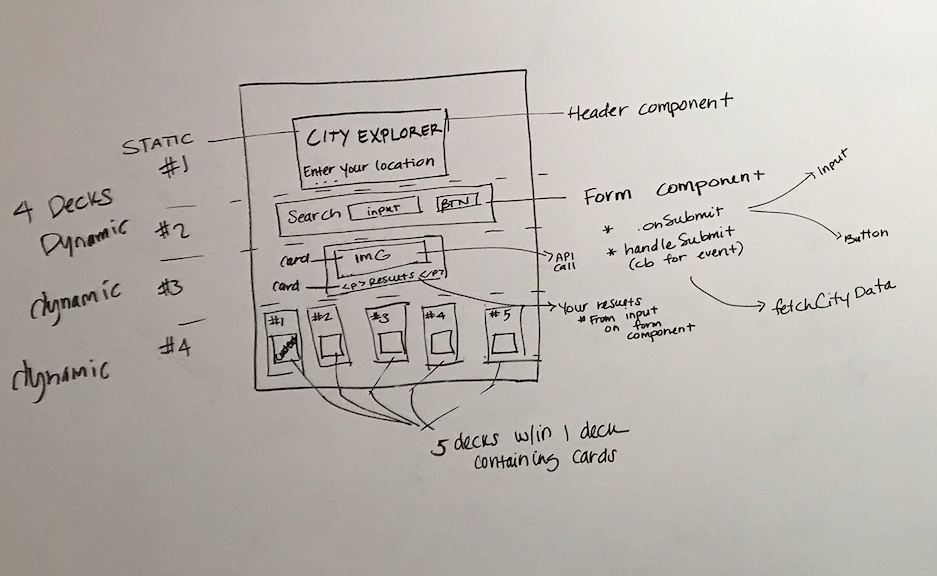

 LAB
=================================================

## City-Explorer React Build

### Author: Becca Lee, Heather Cherewaty & Caity Heath

### Links and Resources
* [repo](https://github.com/beccalee123/30-project-city-explorer)
* [travis](https://www.travis-ci.com/beccalee123/30-project-city-explorer)
* [back-end](https://city-explorer-backend.herokuapp.com)
* [front-end](https://d3oni9l2gjzuzv.cloudfront.net/) 

### Modules
#### `index.js`
Renders the app component.
#### `App.js`
Renders the search component.
#### `search.js`
Renders a form with an input and on submit the page renders the following components
#### `when.js`
A conditional component that renders children dependent up the assigned condition. 
#### `meetup.js`
Renders Meetup time, date and host data from the Meetup API
#### `movies.js`
Renders Movie data from the Movies API
#### `trails.js`
Renders trails and trail conditions from the data from the Trails API 
#### `weather.js`
Renders forecast and time data from the Weather api
#### `yelp.js`
Renders restaurant pricing, rates and descriptive data from the Yelp api. 

### Setup
#### `.env` requirements
None!

#### Running the app 
Click on the front-end link listed under Links and Resources. That will take you to a landing page.
Enter a location into the input form and discover things to do there. Information about weather, networking events, hiking trails, movies and restaurants will generate. 

#### Running the app Locally
* `npm i` to install package dependencies
* `npm start` will navigate to the front-end page in your browser. 
* Search for a location.
  * Discover activities to do in the area.
  
#### Tests
* To run tests use the command `npm test`
* Does the data from Google Maps, Dark Sky, Meetup, Yelp, Movies DB and Yelp exist?
* 

#### UML
City Explorer React Components 

